# MALLORN Astronomical Classification Challenge


This repository contains an end-to-end machine learning pipeline identifying rare **Tidal Disruption Events (TDEs)** from multi-band astronomical lightcurve data. Designed specifically around simulated observations from the Vera C. Rubin Observatory's Legacy Survey of Space and Time (LSST), the system tackles extreme class imbalance and data sparsity.

By empirically evaluating Deep Sequence Modeling alongside Automated Feature Engineering, this project demonstrates how inductive bias and data representation often supersede raw architectural complexity when working with irregular time-series data.

[](https://mallorn-astronomical-classification-challenge.streamlit.app)

---

## Problem Statement

The goal is to accurately classify **Tidal Disruption Events**: Violent occurrences where stars are torn apart by supermassive black holes using six parallel optical lightcurves (`u`, `g`, `r`, `i`, `z`, `y`) along with static physical metadata (e.g., redshift, galactic dust extinction).

**Core Challenges:**
1. **Severe Class Imbalance:** TDEs represent merely ~**4.86%** of the underlying dataset (approx. 150 training samples).
2. **Extreme Sparsity:** Astronomical observations occur at irregular intervals (MJD) across channels, leading to missing data points and vast temporal gaps. 
3. **Metric Optimization:** Maximizing the macro **F1 Score** explicitly requires trading off Precision against Recall, penalizing false negatives.

---

## Advanced ML Techniques & Engineering Decisions

To tackle the complexities of irregular astronomical data and extreme class imbalance, several advanced data science methodologies were employed:

- **Automated Temporal Feature Abstraction:** Transitioned from manual statistical aggregation to leveraging `tsfresh` (`EfficientFCParameters`). This autonomously extracted thousands of complex time-series characteristics (e.g., continuous wavelet transforms, Fourier coefficients, energy ratios) independently across all 6 optical filter bands.
- **Rigorous Dimensionality Reduction:** To combat the curse of dimensionality, statistical hypothesis testing (`tsfresh.select_features`) was utilized to distill the massive feature space down to the **top 198 most predictive and statistically significant vectors**.
- **Champion / Challenger Architecture Pattern:** Deep empirical experimentation explicitly splitting into a Deep Learning branch (PyTorch Bi-Directional GRUs with custom Attention mechanisms) and a Feature Engineering branch (Gradient Boosting) to evaluate representation learning vs. inductive bias.
- **Cost-Sensitive Learning & Asymmetric Penalization:** Tackling the severe 1:20 minority class skew by explicitly penalizing false negatives via `scale_pos_weight` during LightGBM tree construction.
- **Probability Threshold Optimization:** Moving beyond the naive $P = 0.5$ classification boundary. We optimized the decision threshold across Out-Of-Fold (OOF) predictions during 5-Fold Stratified Cross-Validation, mathematically identifying an optimal threshold ($P > 0.35$) that maximizes the macro F1 surface.
- **Bayesian Hyperparameter Search:** Navigated the complex parameter topology of LightGBM using `Optuna`'s Tree-structured Parzen Estimator (TPE) algorithm over a 50-trial study to locate the global minima of the loss function.
- **Interactive Inference Lab:** Deployed a `Streamlit` application for rapid exploratory data analysis (EDA), lightcurve visualization, and interactive threshold simulation.

---

## System Architecture

The core of the system represents a fork in methodology. While the ingestion layer uniformly unifies raw logs and irregular multi-channel flux, the experimentation forces a pivot away from RNNs and exclusively towards LightGBM and `tsfresh`.



*The **Diagnosis Pivot**: Our custom Bi-GRU networks critically failed to infer signal from the data gaps. LightGBM empirically validated that manual and automated temporal aggregations sidestep the sparsity constraints.*

---

## Project Structure

```text
.
├── dashboard/               # Streamlit application codebase
│   └── app.py               # Front-end visualization and inference lab
├── data/                    # Local storage for CSV metadata and folder-partitioned time-series
│   ├── train_log.csv
│   ├── test_log.csv
│   └── split_*/             # Raw Lightcurve files partitioned in chunks
├── notebooks/               # R&D Jupyter Notebooks
│   ├── 01_initial_exploration.ipynb   # Exploratory Data Analysis
│   ├── 02_feature_engineering.ipynb   # Tsfresh per-filter extraction logic
│   ├── RNN.ipynb                      # Baseline sequence models and Deep Learning
│   ├── multi_channel_model.ipynb      # Mixture-of-experts parallel Bi-GRU
│   ├── model_1.ipynb                  # Baseline modeling (Basic Stats)
│   ├── model_2.ipynb                  # Tsfresh integration
│   ├── model_3.ipynb                  # Final Optuna optimization 
│   └── submission.ipynb               # Submitting final predictions 
├── requirements.txt         # Project dependencies
└── README.md                # Documentation 
```

---

## Data Pipeline & Model Design

### 1. The Challenger: Deep Sequence Modeling (Bi-GRU)
Our initial hypothesis suggested that given enough capacity, Recurrent Neural Networks could map irregular lightcurves directly onto a latent space. We built:
* **Single-Channel Bi-GRU + Attention:** Concatenating observations and utilizing attention to weigh temporal importance.
* **Multi-Channel Bi-GRU Architectures:** Six parallel encoders, assigning a distinct GRU "expert" per-optical filter, passing concatenated hidden states to a final dense classifier.

*Outcome:* **Misfire.** Standard RNN representations deteriorated due to the sparsity variance across observation intervals and extreme dataset skew. The sequence models achieved a maximum CV F1 Score of merely ~0.18.

### 2. The Champion: Automated Feature Abstraction (LightGBM + `tsfresh`)
By abandoning the constraint of learning time-steps iteratively, we transitioned to statistically abstracting the temporal distributions using `tsfresh`:
* **Per-Filter Isolation:** Extracted time-series characteristics (Fourier coefficients, kurtosis, continuous wavelets, standard deviations) for each filter autonomously.
* **Dimensionality Reduction:** Curtailed the expanding tensor via `tsfresh.select_features`, utilizing significance testing to keep exactly **198 highly actionable features**.
* **Gradient Boosting:** Processed sparse tabular abstractions via `LightGBM`. Missing observational abstractions were natively handled by the tree-splits.
* **Hyperparameter Tuning:** A 50-trial `Optuna` Bayesian study extracted the decision boundaries optimally tailored to the asymmetric class distribution.

*Outcome:* **Success.** The pipeline achieved a rigorous Mean CV F1 Score of **0.5225**.

---

## Results & Threshold Optimization

Model performance using stratified 5-fold cross-validation:

| Model Architecture | Feature Representation | Mean CV F1 Score | Inference Insight |
| :--- | :--- | :--- | :--- |
| **LightGBM** | Baseline Statistical Aggregations | 0.4281 | LightGBM handles tabular sparsity well natively. |
| **LightGBM** | Filter Interpolations + Features | 0.4974 | Imputing sparse data injected model noise. |
| **Bi-GRU (Attention)** | Raw Multi-channel Lightcurves | 0.1800 | Deep architectures failed on the data sparsity constraint. |
| **LightGBM** | **`tsfresh` Selected 198 Vectors** | **0.5225** | **Best Performance.** Automated abstraction captures local maxima accurately. |

**Thresholding Strategy:**
Due to extreme skew ($1$ positive TDE instance for every $20$ negative profiles), standard soft-max thresholds evaluate poorly. Through threshold sweep testing, the decision boundary was calibrated to **$P > 0.35$**, optimizing our metric objective function and successfully capturing transient events at the expense of marginal false positives.

---

## Key Technologies

- **Python (3.9+)** - Ecosystem base.
- **PyTorch** - Employed for the deep recurrent neural networks and attention mechanics.
- **LightGBM** - Scalable Gradient Boosted decision tree framework logic.
- **tsfresh** - Used exclusively for the automated extraction of temporal statistics.
- **Optuna** - Bayesian inference applied to hyperparameter sweeps.
- **Streamlit & Plotly** - Interactive frontend dashboards and lightcurve plotting.

---

## Installation and Setup

1. **Clone the Repository:**
   ```bash
   git clone https://github.com/BhargavKumarNath/MALLORN-Astronomical-Classification-Challenge.git
   cd MALLORN-Astronomical-Classification-Challenge
   ```

2. **Establish Environment:**
   *(It is highly recommended to isolate dependencies via python virtual environments.)*
   ```bash
   python -m venv .venv
   source .venv/bin/activate  # macOS / Linux
   # OR
   # .venv\Scripts\activate  # Windows
   ```

3. **Install Dependencies:**
   ```bash
   pip install --upgrade pip
   pip install -r requirements.txt
   ```

---

## Usage Instructions

### Streamlit Application (Inference Lab)
We built an interactive UI demonstrating data drift visualization, deep modeling diagnoses, and the final pipeline logic. Launch it via:

```bash
python -m streamlit run dashboard/app.py
```

### Reproducing the Pipeline
Notebook execution occurs sequentially:
1. Initialize EDA and data extraction utilizing `01_initial_exploration.ipynb` and `02_feature_engineering.ipynb`.
2. Inspect the failed deep learning architectures utilizing `RNN.ipynb` and `multi_channel_model.ipynb`.
3. To replicate the champion pipeline, step through `model_2.ipynb` to establish the `tsfresh` extractions, followed by `model_3.ipynb` to initiate `Optuna` training matrices. `submission.ipynb` manages batch inference thresholding.

---

## Limitations and Future Improvements

* **Color Imputation:** We manually attempted to impute synthetic missing color indices across filters; this performed negatively as the variance generated outstripped the physical signal. A bespoke Variational Autoencoder (VAE) dedicated to sequential imputation prior to gradient boosting extraction could mitigate this.
* **Deep Architectural Retools:** A transition from RNN networks to Transformers, effectively removing sequential dependency through robust positional and timestamp encodings, represents a structurally sound path forward to revisit sequence-to-sequence mappings.

---

## License
MIT License. Please view the [LICENSE](LICENSE) file for the full documentation clause.
